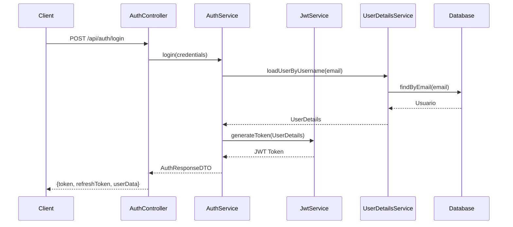
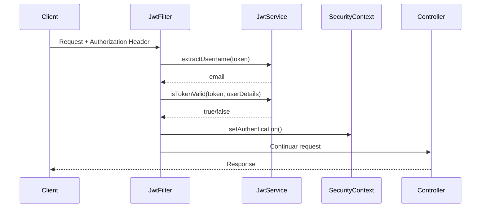

# Sistema de Autenticación y Autorización con JWT

## 📋 Descripción General

Este sistema implementa autenticación basada en JWT (JSON Web Tokens) y autorización basada en roles utilizando Spring Security 6.x.

## 🔐 Características Implementadas

### 1. **Autenticación JWT**
- Generación de tokens de acceso (válidos por 24 horas)
- Generación de refresh tokens (válidos por 7 días)
- Validación automática de tokens en cada request
- Encriptación de contraseñas con BCrypt

### 2. **Roles de Usuario**
El sistema maneja tres tipos de usuarios:
- **PACIENTE**: Usuarios que pueden agendar citas
- **MEDICO**: Profesionales de la salud
- **ADMIN**: Administradores del sistema

### 3. **Estados de Usuario**
- **ACTIVO**: Usuario con acceso completo
- **INACTIVO**: Usuario deshabilitado temporalmente
- **BLOQUEADO**: Usuario bloqueado permanentemente

## 🏗️ Arquitectura

### Componentes Principales

#### 1. **JwtService** (`security/JwtService.java`)
Servicio para generar y validar tokens JWT:
- `generateToken()`: Genera token de acceso
- `generateRefreshToken()`: Genera token de refresco
- `extractUsername()`: Extrae el email del token
- `isTokenValid()`: Valida el token

#### 2. **JwtAuthenticationFilter** (`security/JwtAuthenticationFilter.java`)
Filtro que intercepta cada request para:
- Extraer el token del header `Authorization`
- Validar el token
- Establecer el contexto de seguridad

#### 3. **CustomUserDetailsService** (`security/CustomUserDetailsService.java`)
Implementa `UserDetailsService` para:
- Cargar usuarios desde la base de datos
- Convertir roles de dominio a roles de Spring Security
- Validar estados de usuario

#### 4. **AuthService** (`services/implementation/AuthServiceImpl.java`)
Lógica de negocio para:
- Registro de nuevos usuarios
- Login y generación de tokens
- Refresh de tokens

#### 5. **SecurityConfig** (`security/SecurityConfig.java`)
Configuración de Spring Security:
- Endpoints públicos y protegidos
- Configuración de filtros JWT
- Configuración de autenticación

## 📡 Endpoints API

### Autenticación

#### 1. Registro de Usuario
```http
POST /api/auth/register
Content-Type: application/json

{
  "nombre": "Juan",
  "apellido": "Pérez",
  "email": "juan.perez@example.com",
  "contraseña": "password123",
  "fechaNacimiento": "1990-01-15",
  "genero": "MASCULINO",
  "telefono": "3001234567",
  "direccion": "Calle 123",
  "ciudad": "Armenia",
  "pais": "Colombia",
  "tipoUsuario": "PACIENTE"
}
```

**Respuesta:**
```json
{
  "token": "eyJhbGciOiJIUzI1NiIsInR5cCI6IkpXVCJ9...",
  "refreshToken": "eyJhbGciOiJIUzI1NiIsInR5cCI6IkpXVCJ9...",
  "tipo": "Bearer",
  "idUsuario": 1,
  "email": "juan.perez@example.com",
  "nombre": "Juan",
  "apellido": "Pérez",
  "tipoUsuario": "PACIENTE"
}
```

#### 2. Inicio de Sesión
```http
POST /api/auth/login
Content-Type: application/json

{
  "email": "juan.perez@example.com",
  "contraseña": "password123"
}
```

**Respuesta:** Misma estructura que el registro

#### 3. Refrescar Token
```http
POST /api/auth/refresh
Authorization: Bearer {refreshToken}
```

**Respuesta:** Nuevo token de acceso con el mismo refresh token

## 🔒 Protección de Endpoints

### Configuración Actual

#### Endpoints Públicos (sin autenticación)
- `/api/auth/**` - Registro, login, refresh
- `/swagger-ui/**` - Documentación API
- `/v3/api-docs/**` - OpenAPI docs

#### Endpoints Protegidos por Rol
- `/api/admin/**` - Solo rol **ADMIN**
- `/api/medicos/**` - Roles **MEDICO** y **ADMIN**
- `/api/pacientes/**` - Roles **PACIENTE** y **ADMIN**
- Todos los demás endpoints requieren autenticación

### Uso en Controladores

Puedes usar anotaciones de seguridad a nivel de método:

```java
@PreAuthorize("hasRole('ADMIN')")
@GetMapping("/admin/usuarios")
public List<Usuario> getAllUsuarios() {
    // Solo accesible por ADMIN
}

@PreAuthorize("hasAnyRole('MEDICO', 'ADMIN')")
@GetMapping("/citas/medico")
public List<Cita> getCitasMedico() {
    // Accesible por MEDICO y ADMIN
}

@PreAuthorize("hasRole('PACIENTE') or hasRole('ADMIN')")
@GetMapping("/citas/paciente")
public List<Cita> getCitasPaciente() {
    // Accesible por PACIENTE y ADMIN
}
```

### Obtener Usuario Autenticado

En cualquier controlador o servicio:

```java
@GetMapping("/perfil")
public ResponseEntity<UsuarioDTO> getPerfil(Authentication authentication) {
    String email = authentication.getName();
    // Buscar usuario por email
    Usuario usuario = usuarioRepository.findByEmail(email)
        .orElseThrow(() -> new ResourceNotFoundException("Usuario no encontrado"));
    return ResponseEntity.ok(mapToDTO(usuario));
}
```

## 🔧 Configuración

### application.properties

```properties
# JWT Configuration
jwt.secret=404E635266556A586E3272357538782F413F4428472B4B6250645367566B5970
jwt.expiration=86400000 # 24 horas en milisegundos
jwt.refresh-expiration=604800000 # 7 días en milisegundos
```

⚠️ **IMPORTANTE**: En producción, usa variables de entorno para el secret:
```properties
jwt.secret=${JWT_SECRET}
```

### Dependencias Maven

```xml
<!-- JWT -->
<dependency>
    <groupId>io.jsonwebtoken</groupId>
    <artifactId>jjwt-api</artifactId>
    <version>0.12.3</version>
</dependency>
<dependency>
    <groupId>io.jsonwebtoken</groupId>
    <artifactId>jjwt-impl</artifactId>
    <version>0.12.3</version>
    <scope>runtime</scope>
</dependency>
<dependency>
    <groupId>io.jsonwebtoken</groupId>
    <artifactId>jjwt-jackson</artifactId>
    <version>0.12.3</version>
    <scope>runtime</scope>
</dependency>
```

## 🧪 Pruebas con Postman/Thunder Client

### 1. Registrar un usuario
```
POST http://localhost:8080/api/auth/register
```

### 2. Login
```
POST http://localhost:8080/api/auth/login
```

### 3. Usar endpoints protegidos
Agrega el header en cada request:
```
Authorization: Bearer {token}
```

## 📝 Flujo de Autenticación



## 🔐 Flujo de Autorización



## 🛡️ Mejores Prácticas Implementadas

1. ✅ **Stateless Authentication**: Sin sesiones en servidor
2. ✅ **Password Encryption**: BCrypt para contraseñas
3. ✅ **Token Expiration**: Tokens con tiempo de vida limitado
4. ✅ **Refresh Tokens**: Para renovar acceso sin re-login
5. ✅ **Role-Based Access Control**: Autorización por roles
6. ✅ **Account Status Validation**: Verificación de estados de usuario
7. ✅ **CSRF Disabled**: Apropiado para APIs REST stateless

## 📚 Próximas Mejoras Sugeridas

1. **Rate Limiting**: Limitar intentos de login
2. **Password Reset**: Recuperación de contraseña por email
3. **Email Verification**: Verificación de email al registrarse
4. **Audit Logging**: Registro de intentos de acceso
5. **Token Blacklist**: Invalidar tokens al logout
6. **2FA**: Autenticación de dos factores
7. **OAuth2**: Integración con Google, Facebook, etc.

## 📖 Referencias

- [Spring Security Documentation](https://docs.spring.io/spring-security/reference/)
- [JWT.io](https://jwt.io/)
- [JJWT Library](https://github.com/jwtk/jjwt)

---

**Desarrollado para MediApp - Sistema de Gestión de Citas Médicas**
